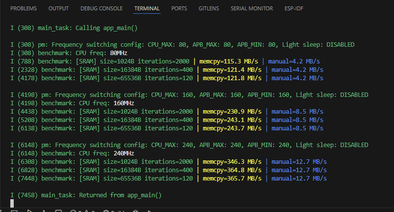
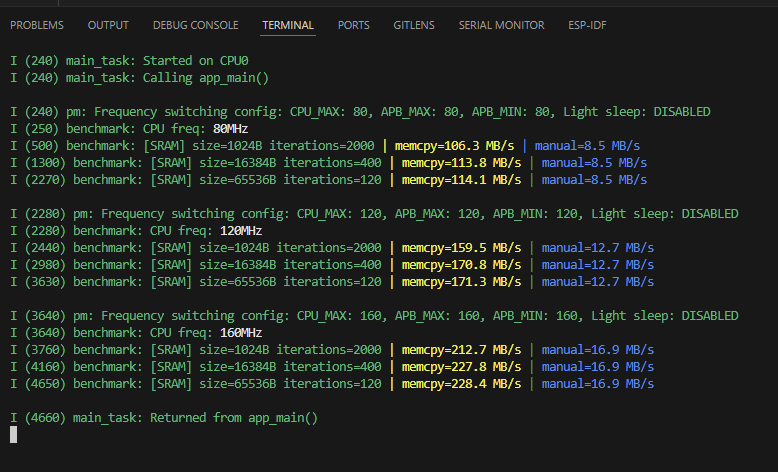

# ESP32 memcpy / manual copy micro-benchmark (SRAM & PSRAM)

Small, focused micro-benchmark that measures memory copy throughput (MB/s) on ESP32:
- `memcpy()` on internal SRAM  
- naive byte-wise copy (volatile) on internal SRAM  
- optional `memcpy()` between **SRAM ↔ PSRAM** (if PSRAM is enabled)

It **locks the CPU** at multiple frequencies (80/160/240 MHz) and reports results per setting.

> Tested with **ESP-IDF v5.5**. Uses `esp_timer`, `esp_pm`, `heap_caps`, and clock-tree APIs.

---

## Example Output

### ESP32 classic

### ESP32-C6

## Why this exists

When tuning performance, you want to see:
- How `memcpy()` scales with CPU frequency
- The gap between optimized `memcpy()` and a naive byte loop
- Cost of moving data across memory domains (SRAM ↔ PSRAM)

This project gives you quick, comparable numbers with minimal fuss.

---

## How it works

- Frequency locking: uses esp_pm_configure() to pin CPU at 80/160/240 MHz.
- Timing: esp_timer_get_time() around inner loops.
- SRAM buffers: allocated via heap_caps_malloc(..., MALLOC_CAP_8BIT | MALLOC_CAP_INTERNAL).
- PSRAM buffers: allocated with MALLOC_CAP_SPIRAM if PSRAM is enabled.
- Manual copy: volatile byte loop to prevent the compiler from optimizing away the body.

---

## What it measures

For each CPU frequency and buffer size, it logs **MB/s** for:

- **SRAM → SRAM**
  - `memcpy()`
  - manual byte-wise copy (volatile)
- **PSRAM tests** (only if PSRAM is enabled in menuconfig)
  - **SRAM → PSRAM** via `memcpy()`
  - **PSRAM → SRAM** via `memcpy()`

---

